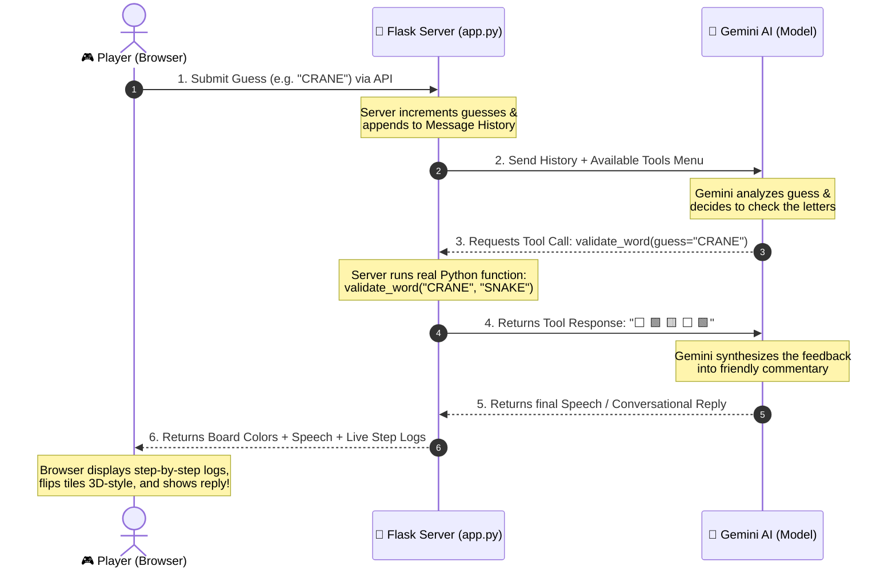

# 🧠 AI Wordle Game Master: How It Works!

Welcome! If you are new to programming, APIs, or building AI-powered web applications, this guide is written specifically for you. We will break down exactly how this app works under the hood, explaining the big ideas without any confusing jargon.

---

## 🧭 The Big Picture Architecture

When you type a word and press Enter, a beautiful sequence of events is triggered across three main layers: your browser, your local Flask server, and Google's Gemini AI brain.

Here is the exact journey of your guess:



---

## 🧩 Deep Dive into the Two Big Ideas

### 1. Function Calling ("Tools")
Normally, an AI model can only produce **text** or **images**. It doesn't know what time it is, it can't check the weather, and it doesn't know if your Wordle guess is correct.

**Function Calling** gives the AI "hands." We hand the model a text description of our Python functions (called "Tools"). The AI reads these descriptions, looks at the player's guess, and decides: *"Aha! I need to know which letters in 'CRANE' are correct. Let me press the `validate_word` button!"*

The AI doesn't run the Python function itself (it doesn't have access to your computer). Instead, it **returns a request** telling your code: *"Please run `validate_word` with guess='CRANE' and tell me the result."* Your Flask server runs the real Python code, gets the feedback, and passes it back to the AI.

Here is how we tell Gemini that the `validate_word` tool exists (defined in `wordle_agent_starter.py` and reused in `app.py`):
```python
tools = [
    {
        "type": "function",
        "function": {
            "name": "validate_word",
            "description": "Check the player's 5-letter guess and return color feedback.",
            "parameters": {
                "type": "object",
                "properties": {
                    "guess": {
                        "type": "string",
                        "description": "The player's 5-letter guess"
                    }
                },
                "required": ["guess"]
            }
        }
    }
]
```

### 2. The Agentic Loop
A standard chatbot is simple: you ask a question, it replies once, and it stops.

An **Agentic Loop** is different. It is a smart loop where the AI can take multiple actions on its own, evaluate the results, and repeat until its goal is achieved.

In our Wordle app, each turn runs a mini-loop:
1. **Model Call 1**: We send the player's guess. Gemini determines it needs to evaluate the guess and asks to run `validate_word`.
2. **Execution**: Our Python backend executes the tool and gets the colorful feedback (e.g. `🟩 🟨 ⬜ 🟩 ⬜`).
3. **Model Call 2 (Follow-up)**: We send this feedback back to Gemini. Gemini reads the colors, checks if the player won, and crafts a conversational response (e.g., *"Excellent guess! You found the R in the correct spot..."*).
4. **Completion**: If the guess was correct, Gemini requests to call the `end_game` tool, concluding the loop!

---

## 📂 Understanding the Code Files

Our codebase is organized into small, focused modules. Here is what each file does:

| File Name | Language | Role / Responsibility | Simple Analogy |
| :--- | :--- | :--- | :--- |
| `wordle_agent_starter.py` | Python 🐍 | Contains core game algorithms (`validate_word`, `end_game`), tools definitions, and connection to Gemini. | **The Muscle & Senses**: The raw mechanics and rules of the game. |
| `app.py` | Python 🐍 | The Flask web backend. It boots a local server, handles web traffic, secures the API key, and drives the Gemini agentic loop. | **The Nervous System**: Links the visual screen to the AI brain. |
| `templates/index.html` | HTML5 🌐 | Defines the structure of the webpage: the 6x5 grid, the QWERTY keyboard, and the AI Brain Logs terminal panel. | **The Skeleton**: The basic bones and layout of the app. |
| `static/css/style.css` | CSS3 🎨 | Applies modern dark themes, glowing borders, frosted-glass effects, and 3D flip card animations. | **The Skin & Clothes**: Making everything look gorgeous, futuristic, and alive. |
| `static/js/game.js` | JavaScript ⚡ | Listens to physical/virtual typing, coordinates requests to Flask, triggers sequential log pacing, and opens modals. | **The Reflexes**: Managing clicking, typing, and visual transitions. |
| `.env` | Plain Text 🔑 | Stores your confidential `GEMINI_API_KEY`. | **The Vault**: Keeping secret keys safe and out of the public code. |

---

## 🔑 Crucial Rule: Why use `.env`?

You might wonder why we use a separate `.env` file instead of typing the API key directly into `app.py`.

> [!CAUTION]
> **Never hard-code secret keys!**
> If you upload your code to GitHub with a hard-coded key, bots will scrape it within minutes. They can steal your API access, run up massive bills on your account, or lock you out.
> By placing your key in `.env` (and listing `.env` in your `.gitignore` file), your key stays safely on your computer while letting the Python code load it secretly in the background using `python-dotenv`.

---

## 🏆 Summary of Your Accomplishments
By building this project, you have mastered:
- **API integration** with state-of-the-art LLMs (Gemini).
- **Asynchronous UI design** that makes a webpage feel premium and active.
- **Function Calling & Agentic Loops**, which represent the cutting edge of AI Engineering.

Have fun playing and exploring the agent logs! 🚀
